# C程序设计语言  

练习1-1 在你自己的系统中运行"hello,world"程序。再有意去掉程序中的部分内容，看看会得到什么出错信息。  

```C
#include<stdio.h>
#include<stdlib.h>
int main(void)
{
    printf("hello,world\n");
    system("pause");
    return 0;
}
```

省略printf()后面的分号，编译器会报下图错误：
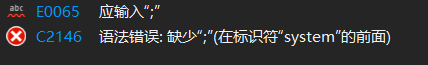  

把\n后面的双引号写成单引号会报如下错误：  
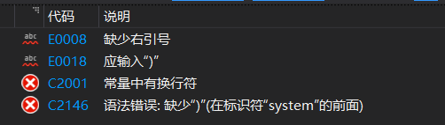  

练习1-2 做个实验，当printf函数的参数字符串包含\c（其中c是上面的转义字符序列中未曾列出的某个字符）时，观察一下会出现什么情况。  

如果\后面紧跟的字符不在指定的字符中，则其行为是为定义的。  
此题在vs2019中会直接输出这个字符c。如图所示：

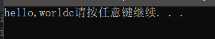  

练习1-3 修改温度转换程序，使之能在转换表的顶部打印一个标题。  
公式：摄氏度=5/9*(华氏度-32)  
范围：0~300
带标题就是为了区分摄氏度和华氏度，还很美观，直接在循环之前加一句printf("%3.0f %6.1f\n", fahr, celsius);即可。  
需明白：格式说明%3.0f代表待打印的浮点数至少占3个字符宽，且不带小数点和小数部分；%6.1f代表待打印的数至少占6个字符宽，且小数点后面有1位数字。  
代码如下：  

```c
#include<stdio.h>
#include<stdlib.h>
int main(void)
{
    float fahr, celsius;
    fahr = 0;
    printf("Fahr    Celsius\n");
    while (fahr <= 300)
    {
        celsius = 5.0 / 9.0 * (fahr - 32.0);
        printf("%3.0f    %6.1f\n", fahr, celsius);
        fahr += 20;
    }
    system("pause");
    return 0;
}

```

运行结果:  
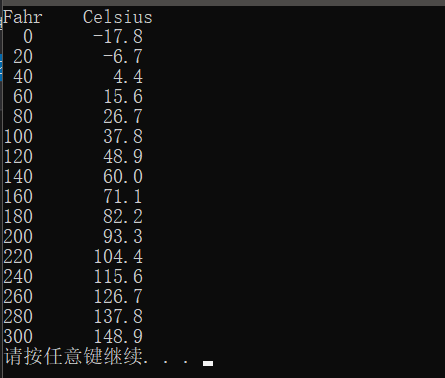  

练习1-4 编写一个程序打印摄氏温度转换为相应华氏温度的转换表。  
与华氏度转摄氏度差不多。
代码：  

```c
#include<stdio.h>
#include<stdlib.h>
int main(void)
{
    float fahr, celsius;
    celsius = 0;
    printf("Celsius    Fahr\n");
    while (celsius <= 300)
    {
        fahr = (9.0*celsius)/5.0+32;
        printf("%3.0f    %6.1f\n", celsius, fahr);
        celsius += 20;
    }
    system("pause");
    return 0;
}
```

运行截图：  
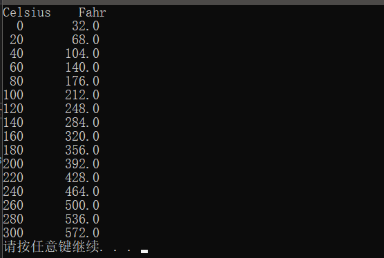  

练习1-5 修改温度转换程序，要求以逆序(即按照从300度到0度的顺序)打印温度转换表。  
代码：

```c  
#include<stdio.h>
#include<stdlib.h>
int main(void)
{
    float fahr, celsius;
    printf("Fahr    Celsius\n");
    for (fahr = 300; fahr >= 0; fahr -= 20)
        printf("%3.0f    %8.1f\n", fahr, (5.0 / 9.0) * (fahr - 32.0));
    system("pause");
    return 0;
}
```

运行截图：  
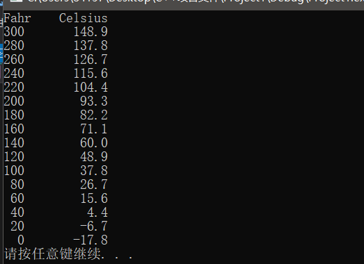

练习1-6 验证表达式getchar()!=EOF的值是0还是1.  
**getchar()函数返回原理**  

当程序调用getchar()时，程序就等着用户按键。用户输入的字符被存放在键盘缓冲区中，直到用户按回车为止(**回车字符也放在缓冲区中**)。
当用户键入回车之后，getchar()才开始从输入流中每次读入一个字符，getchar()函数的返回值是用户输入的第一个字符的ASCII码,如出错返回EOF。如用户在按回车之前输入了不止一个字符，其他字符会保留在键盘缓存区中,待后续getchar()调用读取。也就是说，后续的getchar()调用不会等待用户按键，而直接读取缓冲区中的字符，直到缓冲区中的字符读完为后，才等待用户按键。  

代码：

```c
#include<stdio.h>
#include<stdlib.h>
int main(void)
{
    int c;
    while (c = getchar() != EOF)
        printf("%d\n", c);
    printf("EOF is：%d\n", c);
    system("pause");
    return 0;
}
```

当一直有字符可读时，getchar()不会返回文件结束符(EOF),所以表达式的值为真，变量c的值为1。
当程序遇到文件结束符时，表达式的值为假，此时，变量c将被赋值为0，程序将结束运行。  

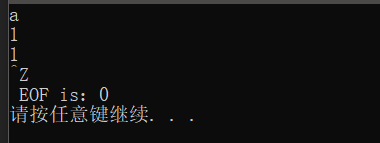  

练习1-7 编写一个打印EOF值的程序。
代码：

```c
#include<stdio.h>
#include<stdlib.h>
int main(void)
{
    printf("EOF is：%d\n", EOF);
    system("pause");
    return 0;
}
```

EOF被定义为-1.

运行截图：  
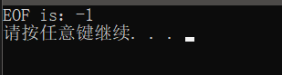  

练习1-8 编写一个统计空格、制表符与换行符个数的程序。  

```C
#include<stdio.h>
#include<stdlib.h>
int main(void)
{
    int c;
    char k = 0, z = 0, h = 0;
    printf("请输入一串字符:\n");
    while ((c=getchar())!=EOF)
    {
        if (c == ' ')
            k++;
        else if (c =='\t')
                z++;
        else if (c == '\n')
            h++;
    }
    printf("空格=%d 制表符=%d 换行符=%d\n", k, z, h);
    system("pause");
    return 0;
}
```

运行截图：  

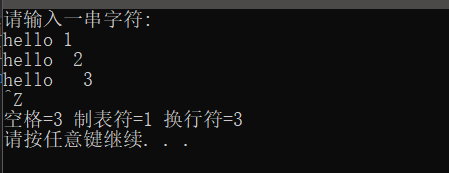  

练习1-9 编写一个将输入复制到输出的程序，并将其中连续的多个空格用一个空格代替。  

```C  
#include<stdio.h>
#include<stdlib.h>
int main(void)
{
    int c;
    char last_c = '1';//初始化为任意非空格字符
    printf("请输入一串字符:\n");
    while ((c=getchar())!=EOF)
    {
        if (c != ' ' || last_c != ' ')
            putchar(c);
        last_c=c;
    }
    system("pause");
    return 0;
}
```

运行截图：  
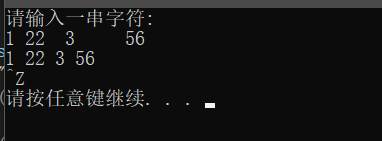  

练习1-10 编写一个将输入复制到输出的程序，并将其中的制表符替换为\t,将回退符替换为\b,将反斜杠替换为\\\。这样可以将制表符和回退符以可见的方式显示出来。  

```C
#include<stdio.h>
#include<stdlib.h>
int main(void)
{
    int c;
    printf("请输入一串字符:\n");
    while ((c=getch())!='\n')//Ctrl+Enter结束程序
    {
    if (c == '\t')
        printf("\\t");
        else if (c == '\\')
            printf("\\\\");
        else if (c == '\b')
            printf("\\b");
        else
            printf("%c", c);
    }
    system("pause");
    return 0;
}
```

练习1-12  编写一个程序，以每行一个单词的形式打印其输入。  

```C
#include<stdio.h>
#include<stdlib.h>
int main(void)
{
 int c;
 char last_c = '1';//保证前一个为非空白字符
 
 printf("请输入一串字符:\n");
 while ((c=getchar())!=EOF)
 {
  if (c != ' ' && c != '\t' && c != '\n')
  {
   putchar(c);
  }
  else if (last_c != ' ' && last_c != '\t' && last_c != '\n')
  {
   putchar('\n');
  }
  last_c = c;//存前一个字符
 }
 system("pause");
 return 0;
}
```

运行截图：  
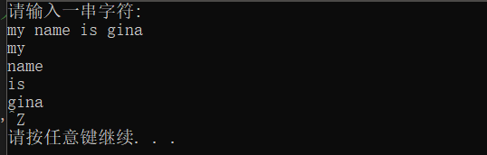  

练习1-13  编写一个程序,打印输入中单词长度的直方图。水平方向的直方图比较容易绘制,垂直方向的直方图则要困难些。  

```c
#include <stdio.h>
#include <stdlib.h>
int main(void)
{
    int c, state = 0;
    int count = 0;// 累加单词字符个数
    while ((c = getchar()) != EOF)
    {
        if (!(c == ' ' || c == '\t' || c == '\n'))
        {
            state = 1;
            putchar(c);//打印单词
            ++count;
        }
        else
        {
            if (state == 1)
            {
                printf("(%d个)", count);
                for (int i = 0; i < count;putchar('#'),++i);
                printf("\n\n");
                count = 0;
            }
            state = 0;
        }
    }
    system("pause");
    return 0;
}

```

运行截图：
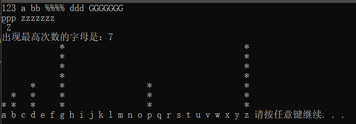  

练习1-14  编写一个程序，打印输入中各个字符出现频度的直方图。  

```c
#include<stdio.h>
#include<stdlib.h>
#include<ctype.h>

int main(void)
{
    int x,max;
    int count[26]; //26个字母出现次数的统计
    char c;

    /*将数组初始化*/
    for (x = 0; x < 26; count[x] = 0, x++);

    while ((c = getchar()) != EOF)
    {
            if (isalpha(c)) //判断是否是字母
            {
                c = tolower(c); //大写转换为小写
                ++count[c - 'a'];
            }
    }
    /*找出出现频率最高的字母*/
    for (max = 0,x = 0; x < 26; x++)
    {
        if (count[x] > max)
            max = count[x];
    }
    printf("出现最高次数的字母是：%d", max);
    /*打印直方图*/
    for (putchar('\n'); max > 0; max--)
    {
        for (x = 0; x < 26; x++)
        {
            if (count[x] >= max)
                putchar('*');

            else
                putchar('\40');

         putchar('\40');
        }
        putchar('\n');
    }
    //打印a~z
    for (x = 0; x < 26; printf("%c\40", 'a' + x), x++);
    system("pause");
    return 0;
}
```

运行截图：  
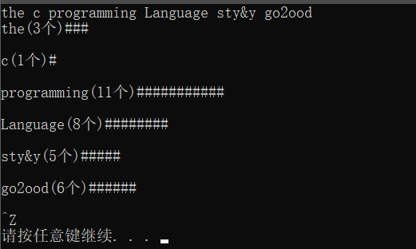

练习1-15 重新编写1.2节中的温度转换程序，使用函数实现温度转换计算。  

```c
#include <stdio.h>
#include <stdlib.h>
float celsius(float fahr)
{
    return (5.0 / 9.0) * (fahr - 32.0);
}
int main(void)
{
    float fahr;
    int lower = 0, upper = 300, step = 20;
    fahr = lower;
    while (fahr <= upper)
    {
        printf("%3.0f %6.1f\n", fahr, celsius(fahr));
        fahr += step;
    }
    system("pause");
    return 0;
}
```

运行截图：

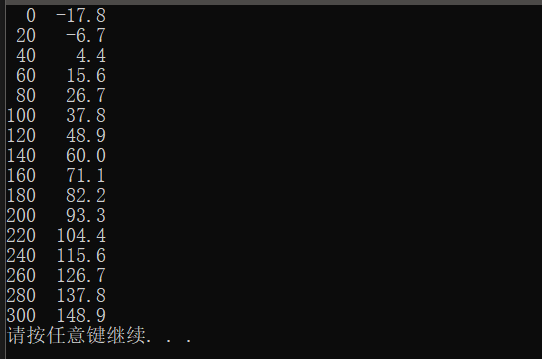  

练习1-16 修改打印最长文本行的程序的主程序main,使之可以打印任意长度的输入行的长度，并尽可能多的打印文本。  

```c
#include <stdio.h>
#include <stdlib.h>
#define MAXLINE 100

int getLine(char line[], int maxline);
void copy(char to[], char from[]);
int main() {

    int max = 0;
    int len = 0;
    char line[MAXLINE];
    char longestLine[MAXLINE];

    for (int i = 0; i < MAXLINE; i++)
    {
        line[i] = 0;
        longestLine[i] = 0;
    }
    while ((len = getLine(line, MAXLINE)) > 0) 
    {//直到读取EOF，getLine()返回长度为0时，停止读取
        printf("%d, %s", len, line);
        if (len > max) 
        {
           max = len;
            copy(longestLine, line);
        }
        if (max > 0) 
        {
        printf("the longestLine = %s", longestLine);
        }
    }
    system("pause");
    return 0;
}
int getLine(char line[], int maxline) 
{
    int c, i, j;
    c = j = 0;
    for (i = 0; (c = getchar()) != EOF && c != '\n'; i++) 
    {
        if (i < maxline - 2)
        {
            line[j] = c;
            j++;
        }
    }
    if (c == '\n') 
    {
        line[j] = '\n';
        j++;
        i++;
    }
    line[j] = '\0';
    return i;
}

void copy(char to[], char from[])
{
    int i = 0;
    while ((to[i] = from[i]) != '\0')
    {
        i++;
    }
}
```

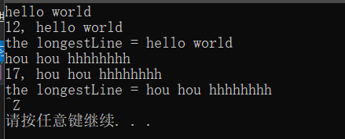  
